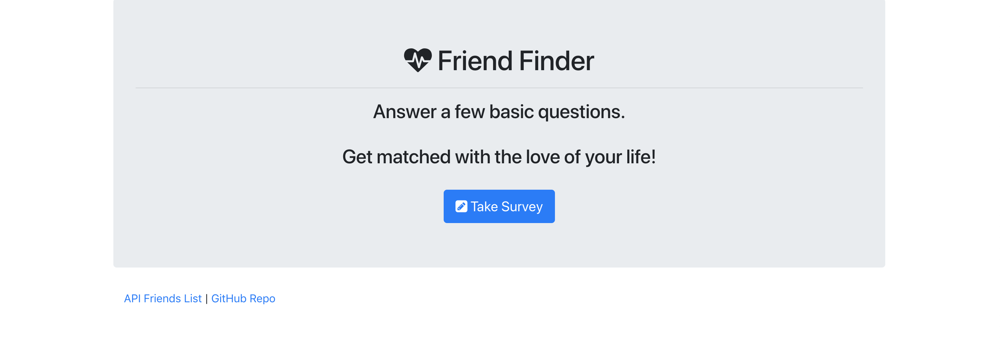
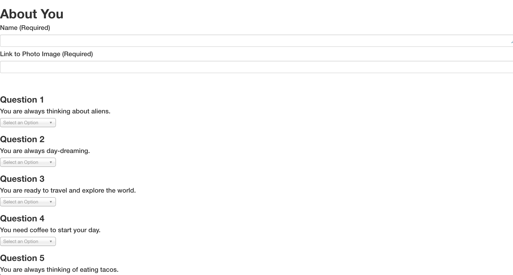
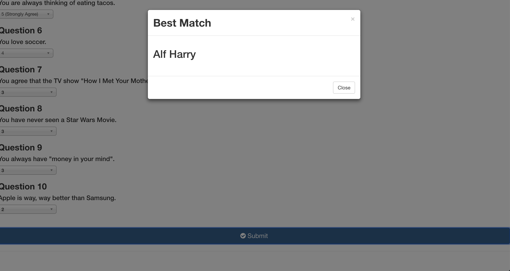

# FriendFinder

## Summary
 https://still-headland-93466.herokuapp.com/

In this application I built a compatibility-based "FriendFinder" application -- basically a dating app. This full-stack site will take in results from the users' surveys, then compare their answers with those from other users. The app will then display the name and picture of the user with the best overall match. 

Express was used to handle routing.

#### Take a survey and get matched with the love of your life. 

#### Fill out the information and submit. 

#### Once you fill and submit the form an alert will pop-up letting you know who is your love match. 

## How to Setup

1. Clone repo to your local machine
2. Install depencies. 
3. Install depedencies from package.json file, by doing "npm install"

To run the customer interface please follow the steps below:

	git clone https://github.com/rparamo11/FriendFinder.git
	cd FriendFinder
	npm install
	node server.js
  in your browser window type - localhost:3000
